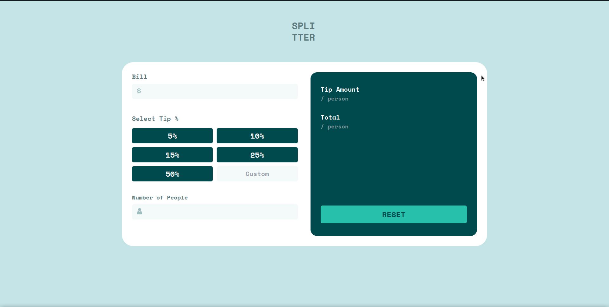
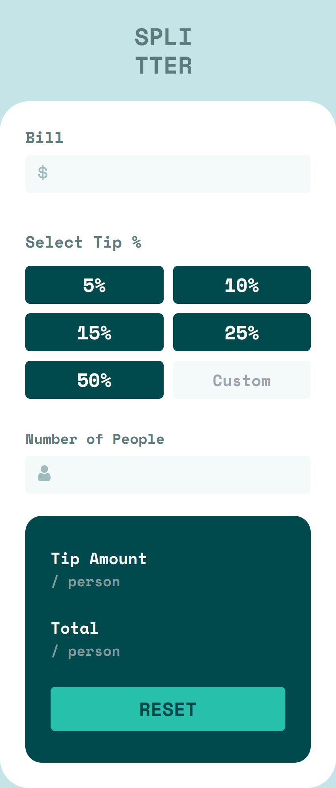

# Frontend Mentor - Tip calculator app solution

This is a solution to the [Tip calculator app challenge on Frontend Mentor](https://www.frontendmentor.io/challenges/tip-calculator-app-ugJNGbJUX). Frontend Mentor challenges help you improve your coding skills by building realistic projects.

## Table of contents

- [Overview](#overview)
  - [The challenge](#the-challenge)
  - [Screenshot](#screenshot)
  - [Links](#links)
  - [Built with](#built-with)
-   [Author](#author)

## Overview

### The challenge

Users should be able to:

- View the optimal layout for the app depending on their device's screen size
- See hover states for all interactive elements on the page
- Calculate the correct tip and total cost of the bill per person

### Screenshot

### Links

- Solution URL: [Solution](https://www.frontendmentor.io/solutions/responsive-tip-calculator-website-DA285ZZrIC)
- Live Site URL: [Netlify](https://subtle-muffin-deadf4.netlify.app)

### Built with

- Semantic HTML5 markup
- [Tailwind CSS](https://tailwindcss.com)
- Flexbox
- Mobile-first workflow
- JavaScript

## Author

- Website - [Laksh Soni]
- Frontend Mentor - [@lakshsoni21](https://www.frontendmentor.io/profile/lakshsoni21)
- Twitter - [@LakshSoni18](https://twitter.com/LakshSoni18)

